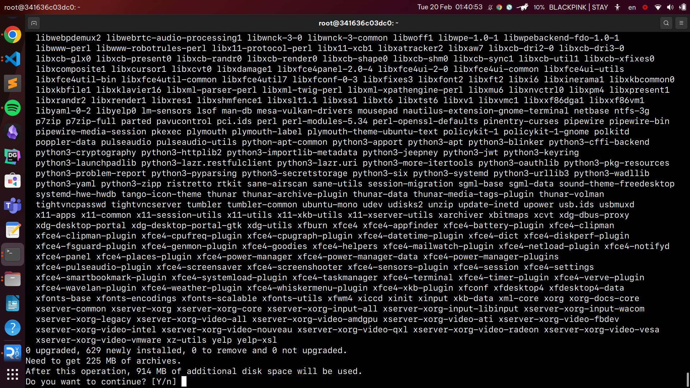
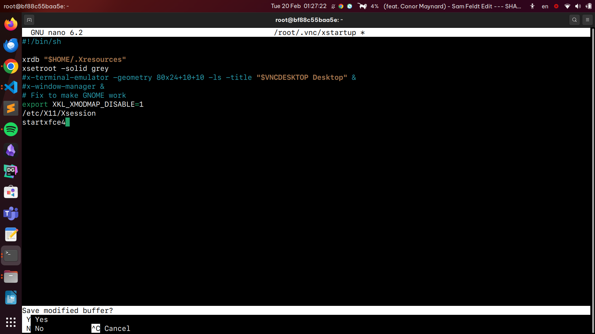
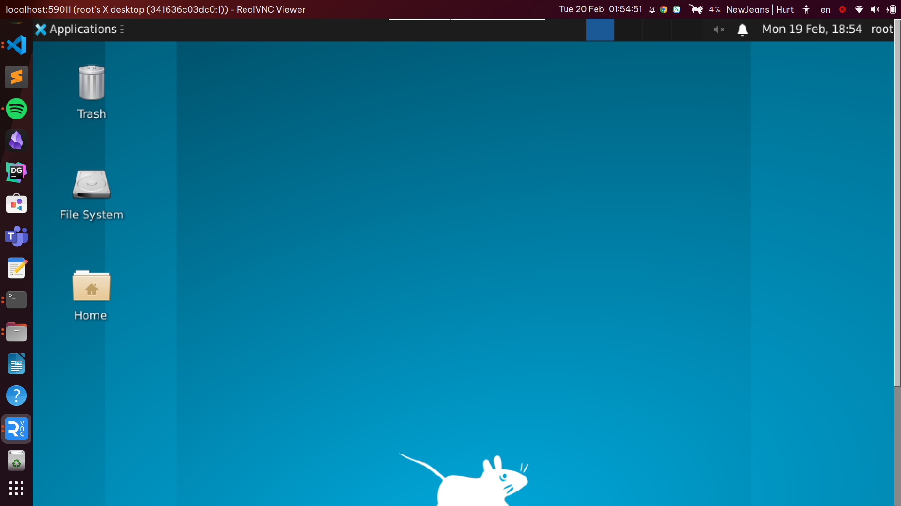

# Bài tập thực hành

## Cài đặt docker compose

`sudo apt update`
`sudo apt install -y python3-pip libffi-dev`
`sudo pip install docker-compose`

## Tạo Dockerfile và docker-compose.yml
Đã gửi kèm trong repo

## SSH vào container vừa tạo
Tiếp theo connect vào container vừa tạo thông qua SSH. Sử dụng command:
`ssh ubuntu@localhost -p 2222`
Chuyển qua tài khoản root thông qua
`su - root`
## Cài đặt DE và VNC Server

Sau khi SSH vào, tiến hành cài đặt DE và VNC Server. Ở đâu em dùng `Xfce4`.
`apt update`
`apt install xfce4 xfce4-goodies tightvncserver`

## Setup VNC Server
Chạy lệnh `vncserver` để đặt mật khẩu truy cập VNC, tạo các tệp cấu hình ban đầu và khởi động phiên bản máy chủ VNC.

Màn hình sẽ hiển thị nhập và xác minh mật khẩu để truy cập vào máy từ xa.

Sửa file `nano ~/.vnc/xstartup` và thêm  `startxfce4` vào cuối file. Trước khi sửa chúng ta cần kill process thông qua `vncserver -kill :1`

Chạy lại VNC server bằng `vncserver`.

## Sử dụng VNC Viewer kết nối với VNC server
Sử dụng VNC Viewer để kết nối với VNC Server thông qua port `59011`

Màn hình hiển thị VNC Viewer

